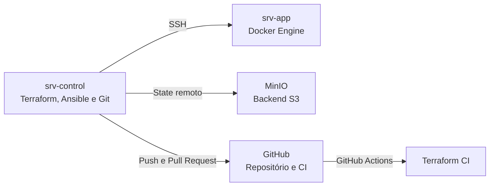

# Laboratório DevOps

Laboratório prático criado para desenvolver conhecimentos em automação, infraestrutura como código, containers, controle de versão e CI/CD.

O projeto utiliza máquinas virtuais Debian executadas localmente, permitindo praticar conceitos próximos de um ambiente corporativo sem utilizar serviços pagos de nuvem.

## Objetivos

- Automatizar configurações de servidores com Ansible
- Criar e gerenciar containers com Docker
- Provisionar infraestrutura com Terraform
- Trabalhar com módulos e ambientes isolados
- Utilizar state remoto com locking e versionamento
- Organizar mudanças com Git e Pull Requests
- Automatizar validações com Bash, Makefile e GitHub Actions
- Praticar promoção de mudanças e rollback

## Arquitetura do laboratório



### Servidores

| Servidor | Função |
|---|---|
| `srv-control` | Nó de controle com Terraform, Ansible, Git e scripts |
| `srv-app` | Servidor Docker que executa os containers |
| MinIO | Backend remoto compatível com S3 para armazenar states |

## Tecnologias utilizadas

- Linux Debian
- Git e GitHub
- Ansible
- Docker e Docker Compose
- Terraform
- Nginx
- Redis
- MinIO
- Bash
- Make
- GitHub Actions

## Estrutura do projeto

```text
lab-devops/
├── .github/
│   └── workflows/
│       └── terraform-ci.yml
├── ansible/
├── docker/
├── scripts/
│   ├── terraform-ci.sh
│   └── terraform-plan.sh
├── terraform/
│   ├── primeiro-lab/
│   ├── segundo-lab/
│   ├── terceiro-lab/
│   └── quarto-lab/
│       ├── environments/
│       │   ├── homologacao/
│       │   └── producao/
│       └── modules/
│           └── container/
├── Makefile
└── README.md
```

## Terraform

Durante o laboratório foram praticados:

- Providers e resources
- Variáveis e outputs
- `for_each` e `map(object)`
- Módulos reutilizáveis
- Planos salvos
- Workspaces
- Importação de recursos existentes
- Detecção de drift
- Healthchecks
- Persistência com volumes
- Separação entre homologação e produção
- State remoto
- State locking
- Versionamento de state
- Promoção de mudanças
- Substituição controlada com `-replace`
- Rollback com Terraform e Git

### Ambientes isolados

O quarto laboratório utiliza configurações e states independentes:

| Ambiente | Container | Porta | State remoto |
|---|---|---:|---|
| Homologação | `app-homologacao` | `8091` | `quarto-lab/homologacao/terraform.tfstate` |
| Produção | `app-producao` | `8092` | `quarto-lab/producao/terraform.tfstate` |

Essa separação reduz o risco de uma alteração em homologação afetar acidentalmente a produção.

## Backend remoto

Os states são armazenados em um backend MinIO compatível com S3.

Foram configurados:

- Bucket privado
- Versionamento de objetos
- States separados por ambiente
- State locking com arquivo `.tflock`
- Credenciais fornecidas por variáveis de ambiente

Arquivos de state, planos e credenciais não são versionados no Git.

## Automação local

O `Makefile` fornece uma interface simples para as tarefas do projeto:

```bash
make help
```

### Formatar os arquivos

```bash
make fmt
```

### Executar as validações locais

```bash
make ci
```

### Formatar e validar

```bash
make check
```

### Gerar planos dos ambientes

```bash
make plan
```

Também é possível executar separadamente:

```bash
make plan-homologacao
make plan-producao
```

## CI com GitHub Actions

A pipeline é executada automaticamente em pushes para a `main` e em Pull Requests que alterem o laboratório Terraform.

O workflow executa:

```text
terraform fmt -check
        ↓
terraform init -backend=false
        ↓
terraform validate em homologação
        ↓
terraform validate em produção
```

A CI não recebe credenciais do backend e não executa `terraform apply`.

## Fluxo de mudança praticado

```text
Criação da branch
        ↓
Alteração do código
        ↓
Validação local
        ↓
Commit e push
        ↓
Pull Request
        ↓
GitHub Actions
        ↓
Revisão e aprovação
        ↓
Merge na main
```

Para mudanças de infraestrutura, o fluxo utilizado foi:

```text
Plan em homologação
        ↓
Revisão
        ↓
Apply e validação
        ↓
Plan em produção
        ↓
Aprovação
        ↓
Apply e validação
        ↓
Rollback, quando necessário
```

## Segurança

Este repositório não armazena:

- Senhas
- Tokens
- Credenciais do MinIO
- Arquivos `terraform.tfstate`
- Planos `*.tfplan`
- Arquivos locais `terraform.tfvars`
- Cache `.terraform`

Os arquivos `terraform.tfvars.example` documentam apenas o formato esperado das configurações locais.

## Autor

**Diego Ribeiro da Silva**

Profissional de infraestrutura estudando e praticando DevOps, automação, containers, infraestrutura como código e CI/CD.

[LinkedIn](https://www.linkedin.com/in/diego-silva-ribeiro/) | [GitHub](https://github.com/diegosilva12)
